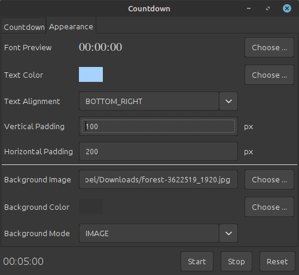
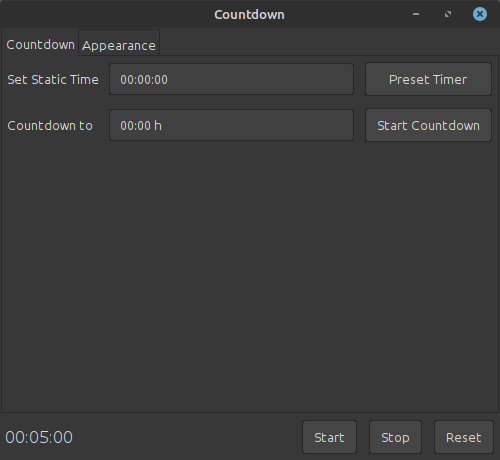

# SimpleCountdown
SimpleCountdown lets you display a customizable countdown for live events, services and more

## Demonstration


Background image source: [@jplenio](https://pixabay.com/de/users/jplenio-7645255/) on pixabay.

### Control Window



Control font family, size, style, text color and alignment. Different modes are available: 
Background image, Fixed color and Transparent (experimental).

**Important Note**: Transparency is not fully supported by Java AWT. Except bugs 
(tested on Linux Mint 21 and Windows 11)



The application supports two different counting setup.
1. Classic mode: Preset timer with fixed time value
2. Clock mode: Counting towards specific time (e.g. 22:11 using 24-hour format)

Timer can be started, paused or reset at any time
## Installation and building

Requires Java 17 and Apache Maven.

Build executable JAR File using the following command. JAR File is named `SimpleCountdown-<VERSION>-jar-with-dependencies.jar`
and located in `target` directory.

```sh
$ mvn package
```

## Dependencies

- [JFontChooser@2.5.2](https://github.com/dheid/fontchooser) by Daniel Heid

## To-Do

- [ ] Overlay mode instead of fullscreen mode
- [ ] Selection of output display (currently using the last in multi-display setup)

## License 

This project is licensed under the [General Public License V3](https://www.gnu.org/licenses/gpl-3.0.en.html) (GPLv3).
See [LICENSE](/LICENSE).